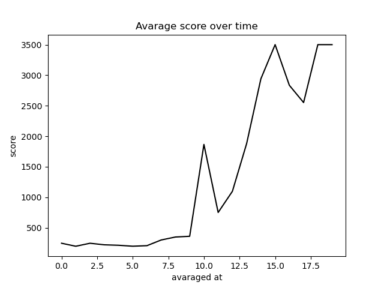

# Self-navigating-vehicle

## Disclaimer
This project has nice premisses, and can serve as a cool RL + control playground. But it needs very very strong maintenace.

## Resources and prerequisites
Projects and resources used as references and sources of insipration:
 * [DEEPLIZARD](https://deeplizard.com/learn/playlist/PLZbbT5o_s2xoWNVdDudn51XM8lOuZ_Njv)
 * [Keon's blog](https://keon.github.io/) 
 * [Path Mind](https://pathmind.com/wiki/deep-reinforcement-learning)
 
Packages: 
 * [Keras](https://keras.io/)
 * [Pymunk](http://www.pymunk.org/en/latest/pymunk.html)
 * [Pygame](https://www.pygame.org/docs/)

## Agent, state and action set

The agent (or a vehicle) has a certain learning process, during which it starts of by exploaring the environment taking random actions in it. Actions lead the agent from the previous state to a new state. Together with that the agent obtains a reward. The underlying logic is to find the action-taking strategy wich yield the greatest cumulative reward.

To give the agent a spacial perception I created a class called *SonarArm()*, which creates an array of detectors that are capable of identifying the color of the pixel they land at. If the color is the one of the *Obstacle()* or if the the sensor is out of the *Border()*, the sensor turns into some non-negative value. At each time step I sum up the readings and substract them from 35, the resultant value is remembred as the score obtained at a new state.

If we colide the penalty score is -500. It was quite a large number, but it was working, so I did not touch it.

There three options to act from:
 - keep moving
 - turn 3 degrees to the right
 - trun 3 degrees to the left
 

## Results

Average reward curve during training process:

Episode recordings:
 1. [Tested in original environment](https://www.youtube.com/watch?v=UOuvcNy_85k)
 
 2. [Tested in slightly modified environment](https://www.youtube.com/watch?v=_JjJafT6PhM)
 
 3. [Tested in pseudo random environment](https://www.youtube.com/watch?v=BGAc1jN2V7Q)
